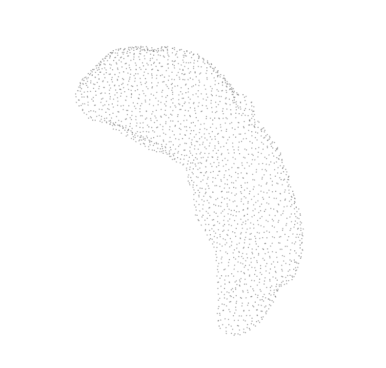

# Datasets:

## pointnet2.py

Function test_9 could reveal how the distance based sampling working.

And the sampling looks okay.

## pointnet2_model_10.py

The dataset function for ModelNet 10 classification problem.

## pointnet

