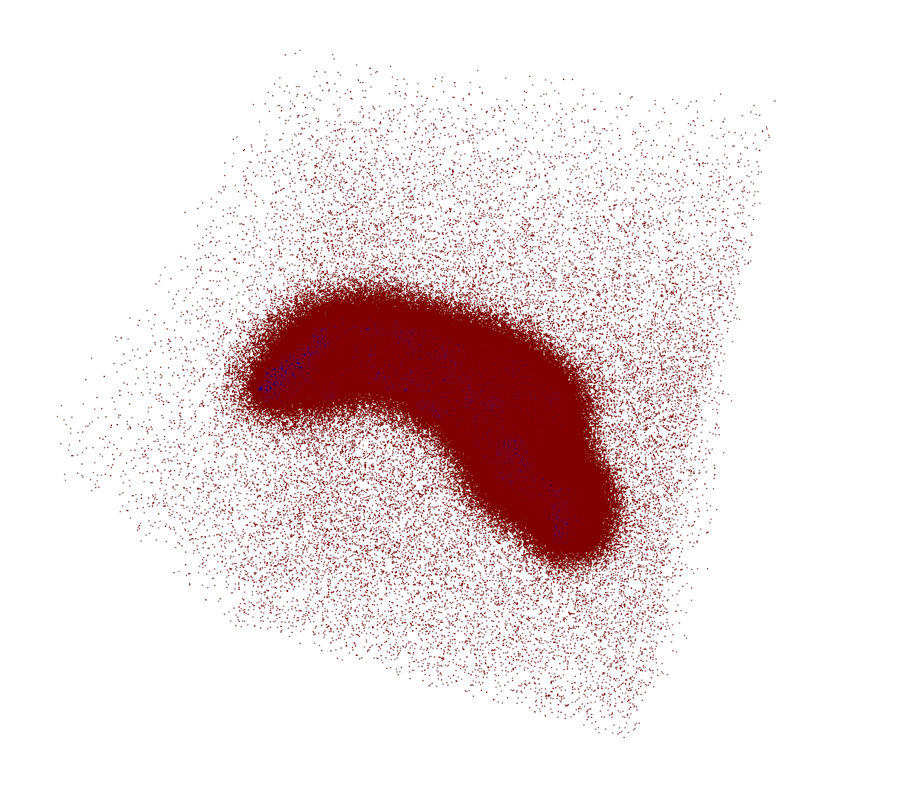

By using the processing mesh bin file provided by `DeepSDF`. The hippocampus is centered and scaled with a [-1, 1] cube.

Visualize it as below.

## process_data.py

This file will save all the m file mesh into obj file mesh.

The m file has the following format.

/home/exx/georgey/dataset/Hippocampus/surface/MCI_neg/002_S_2043_I222697_LHippo.m

The obj file should have the following format.

/home/exx/georgey/dataset/hippocampus/obj/AD_pos/002_S_0729_I291876_LHippo_60k.obj

The new dataset should have the following format:
hippocampus/obj/AD_pos/002_S_0729_I291876/LHippo_60k.obj

- hippocampus --> dataset

- obj --> sub dataset

- AD_pos --> stage

- 002_S_0729_I291876 --> identity

- LHippo_60k.obj  --> specific file name

## volume_classification.py

By running function `volume_knn_classification`, the accuracy is printed. 

