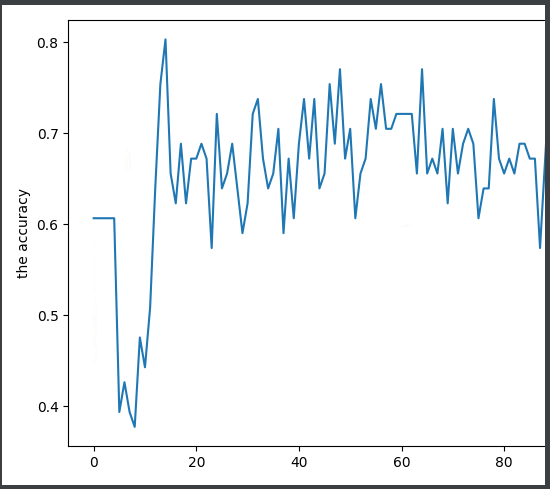

## test.py

The test function to evaluate a checkpoint file. 

The plot from the test.py function.

By running test.py with options in experiments/baseline_pointnet2_test.yml

We get validation accuracy 80.3279, while test accuracy just 62.8205.

So still a long way to go.

