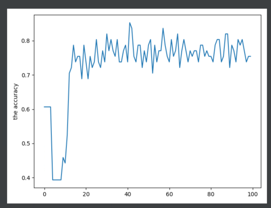

## test.py

The test function to evaluate a checkpoint file. 

The plot from the test.py function.

By running test.py with options in experiments/baseline_pointnet2_test.yml

We get validation accuracy 80.3279, while test accuracy just 62.8205.

So still a long way to go.

Test accuracy without rotation and jitter.

### The table of the PointNet++ baseline. 
 
Train data processing               | validation    | test 
---                                 | ---           | --- 
unit-scale & data augmentation (da) | 80.3279       | 62.8285
unit-scale & no da                  | 85.2459       | 75.6410
constant-scale & da                 | 78.6885       | 71.7949
constant-scale & no da              | 85.2459       | 78.2051

### The table of different experiment set.

All the experiments are conducted under the same data processing, constant scaling and no data augmentation.

Comparison group    | validation    | test      | volume
---                 | ---           | ---       | ---
AD_pos NL_neg       | 85.2459       | 78.2051   | 70 +- 3
MCI_pos MCI_neg     | 72.2222       | 57.1429   | 48 +- 5
NL_pos NL_neg       | 69.0909       | 60.5634   | 61 +- 3

### The table of 10 folds on pointnet

Comparison group    | fold 00           | fold 01           | fold 02           | fold 03
---                 | ---               | ---               | ---               | ---
AD_pos NL_neg       | 85.2459 / 78.2051 | 85.2459 / 80.7692 | 85.2459 / 69.2308 | 81.9672 / 76.9231
MCI_pos MCI_neg     | 72.2222 / 57.1429 | 62.9630 / 61.4286 | 72.2222 / 54.2857 |
NL_pos NL_neg       | 69.0909 / 60.5634 | 70.9091 / 64.7887 |                   |

fold 04             | fold 05             | fold 06
---                 | ---                 | ---
86.8852 / 70.5128   | 86.8852 / 80.7692   | 83.6066 / 79.4872

fold 07             | fold 08             | fold 09
---                 | ---                 | ---
86.8852 / 80.7692   | 85.2459 / 71.7949   | 81.9672 / 76.9231

The first item in each entry is validation accuracy. The second one is test accuracy.
